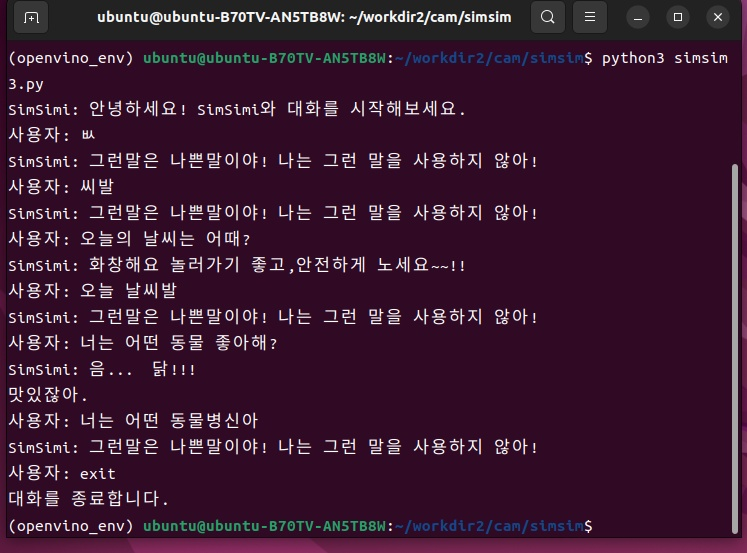

# Project ABC

* 간략히 프로젝트를 설명 :어린이들의 말동무와 친구가 되어줄 수 있도록 시스템 구현하기
   최종 목표 : LLM을 활용하여 어린이 케어용 챗봇을 개발하기

## High Level Design

* OpenCV, STT, TTS, LLM

## Clone code

* 1) 얼굴인식- 표정분석,성별분석 
  2) 음성인식- 답변, 울음
  3) 자연어처리- gemini 로 답변만들어서 음성으로 변환, 아이 능력개발 논문 등등
  4) 일정 및 안전관리(앱)- 울면 연락, 밥먹을시간, cctv기능, 아이가 같이 놀면 알림기능,
  5) 생활 습관 교육- 정해진 시간에 식사, 수면, 개인 위생 등의 생활 습관을 장려하고 지도합니다. 
  6) 비상 연락 및 안전 대응- 위험 상황이 발생했을 때, 즉시 부모나 긴급 연락처로 알림을 보내고, 필요한 경우 기본적인 안전 조치를 취할 수 있어야 합니다.
  7) 부모와의 소통 지원- 부모가 원격으로 로봇을 통해 아이와 소통할 수 있도록 지원합니다. 카메라와 마이크를 통해 아이의 상태를 확인하고, 음성 메시지나 영상 통화 기능을 제공할 수 있습니다
  8) 안전 감시 및 경고 시스템- 아이의 활동을 모니터링하고 위험한 상황이나 비정상적인 행동이 감지될 경우 즉시 부모나 보호자에게 알립니다. 이는 카메라, 소리 감지 센서, 움직임 감지 센서 등을 통해 구현될 수 있습니다.

```shell
git https://github.com/jinhoheoo/coco-friend-project
```

## Prerequite

* (프로잭트를 실행하기 위해 필요한 dependencies 및 configuration들이 있다면, 설치 및 설정 방법에 대해 기술)

```shell
→ https://workshop.simsimi.com/login
→ 심심이 API를 가져옴. 그후 API를 코드에 입력함. 

```shell
python -m venv .venv
source .venv/bin/activate
pip install -r requirements.txt
```

## Steps to build

```

## Steps to build

* (프로젝트를 실행을 위해 빌드 절차 기술)

```shell
→ 가상환경에서 실행 
(openvino_env) ubuntu@ubuntu-B70TV-AN5TB8W:~/workdir2/cam/simsim$ python3 simsim3.py

```

## Steps to run

* (프로젝트 실행방법에 대해서 기술, 특별한 사용방법이 있다면 같이 기술)
(openvino_env) ubuntu@ubuntu-B70TV-AN5TB8W:~/workdir2/cam/simsim$ python3 simsim3.py
이렇게 해서 실행하면 됨. 
실행하기 전에 https://workshop.simsimi.com/login 심심이에 들어가서 나의API를 활성화 해야함.  

```shell
cd ~/xxxx
source .venv/bin/activate

cd /path/to/repo/xxx/
python demo.py -i xxx -m yyy -d zzz
```

## Output

* (프로젝트 실행 화면 캡쳐)



## Appendix

* 자연어의 언어 순서에 중요성 
