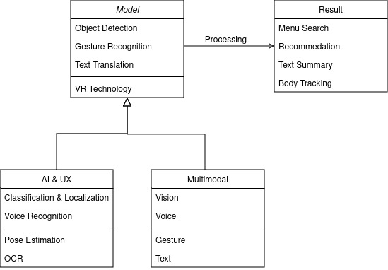

# Project Travel-Helper

* 최종목표 : VR에서 사용되는 Multi Modal UX Design,
* 실시간 번역 및 정보검색, 출력
* 손동작 인식에 따른 기능 수행
* 음성인식 및 정보변환

Team: Vision amateur

<R&R>

    Members
    Name 	Role
    김마로 	Project Leader, 프로젝트를 총괄 및 검수.
    이원희 	Project Manager, 진행상황 점검 및 UX Design.
    임우섭 	AI modeling, Vision 및 Gesture 인식 관련 AI Modeling.
    오흥천 	Text translation, 자연어 처리 및 정보 검색 Algorithm Modeling.


## High Level Design

* 

## Clone code

1. 손동작 인식 : Mediapipe를 통한 손동작 인식
2. 영역 특정 : 포인트별 Landmark를 통한 좌표 측정 및 Crop image
3. OCR : Pytesseract를 통한 Crop image내 Text OCR
4. 음성인식 : WHisper 모델을 활용한 Speech 2 Text
5. 번역모델과 연결 : 추출된 Text 정보를 Google Translator 및 Search와 연결
6. 정보 검색 : 정보 검색 및 해당 내용 화면에 출력

```shell
git clone https://github.com/ghkfkd1/04_Travel_Helper.git
```

## Prerequite

* (프로잭트를 실행하기 위해 필요한 dependencies 및 configuration들이 있다면, 설치 및 설정 방법에 대해 기술)

```shell
python -m venv .venv
source .venv/bin/activate
pip install -r requirements.txt
```

## Steps to build

* (프로젝트를 실행을 위해 빌드 절차 기술)

```shell
cd ~/xxxx
source .venv/bin/activate

make
make install
```

## Steps to run

* (프로젝트 실행방법에 대해서 기술, 특별한 사용방법이 있다면 같이 기술)

```shell
cd ~/xxxx
source .venv/bin/activate

cd /path/to/repo/xxx/
python demo.py -i xxx -m yyy -d zzz
```

## Output

* (프로젝트 실행 화면 캡쳐)


## Appendix

* OpenCV, Mediapipe
* Transformer, Google Search