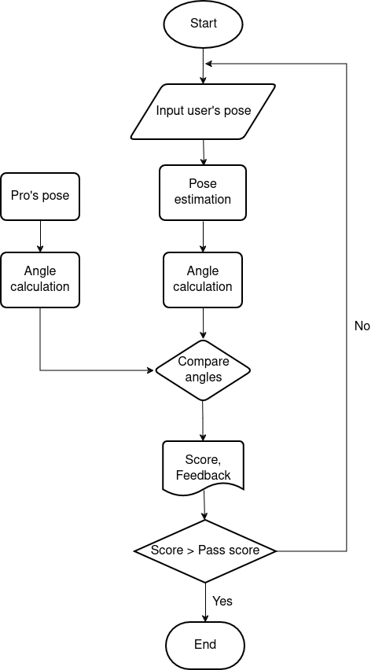
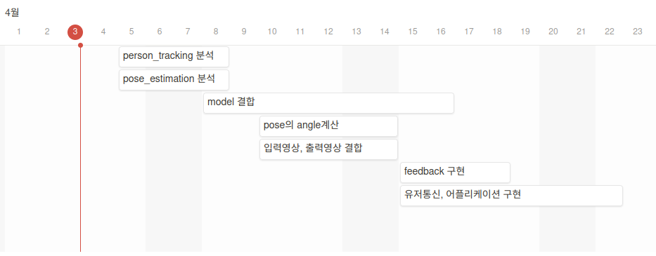

#   Project cp&mv  
●   Person detecting과 Pose estimation 을 이용하여 프로와 아마추어의 자세를    비교하는 프로그램. 아마추어가 이 프로그램을 통해 실력을 향상시킬 수 있다.

##  High Level Design
1. User의 pose를 입력으로 받아 pose estimation과 angle calculation 수행.
2. 미리 pose estimation과 angle calculation이 되있는 Pro(정답)의 결과와 비교.
3. 일치도에 따라 점수를 부여하고, Pass score를 넘으면 통과, 그렇지 못하면 다시 시도.

    

##  Gantt chart

